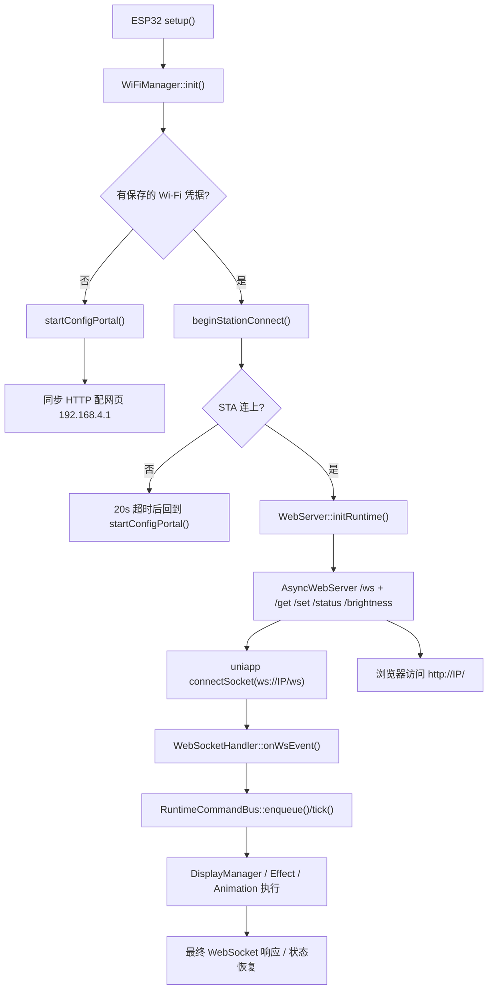

# Glowxel WebSocket 全链路梳理

本文档只基于当前仓库源码梳理，不做臆想兜底。

范围覆盖：

- 板载程序启动
- Wi-Fi 配网 / AP / STA 切换
- 板载本地页面访问与参数修改
- 运行态 HTTP / WebSocket 服务启动
- uniapp 连接 WebSocket、发送命令、等待响应
- 固件接收 WebSocket、JSON / 二进制处理、事务提交、模式切换
- 断开、超时、错误、回滚、恢复

## 0. 本轮定档结论

本轮不再把这条链路当成“可随手优化区域”，而是按核心稳定链路定档。

定档范围：

- `esp32-firmware/src/main.cpp`
- `esp32-firmware/src/wifi_manager.cpp`
- `esp32-firmware/src/web_server.cpp`
- `esp32-firmware/src/websocket_handler.cpp`
- `esp32-firmware/src/runtime_command_bus.cpp`
- `uniapp/utils/webSocket.js`
- `uniapp/store/device.js`

定档后冻结规则：

- 不允许再随手改这条链路的启动时序、root 路由职责、`/ws` 可用条件、事务发送主链、状态字段合同。
- 若后续必须改，必须先补风险清单、明确影响边界、跑完回归验证，再单独提交。
- 禁止为了“兼容旧逻辑”新增字段、别名字段、影子状态或多键回退。

### 0.1 风险优先级

`P0`

- 运行态未真正启动前，uniapp 先发起 WebSocket 握手，导致握手长时间不上 `onOpen`，最后前端自己超时关闭。
- `tx_begin -> accepted -> tx_commit -> final_ok/final_error` 任一环回包丢失，用户会直接感知为“模式失败 / 一直发送中 / 黑屏不恢复”。
- `/status` 返回字段合同一旦被改动，uniapp 会出现“已连接但状态同步失败”，后续所有模式态判断都会失真。
- 时间同步仍是运行态画面恢复闸门，若恢复顺序被打乱，会被误判成“连上以后黑屏”。
- `AsyncTCP` 事件线程若和 Arduino `loop()` / 运行态渲染强绑同一核心，在高负载业务态下可能出现“TCP 已 accept，但 `/status` 与 `/ws` 上层回调长时间不上来”，前端最后只看到握手超时与 `1006` 关闭。

`P1`

- WebSocket 文本入口与 `RuntimeCommandBus` 吞吐不对齐，容易在高频状态查询、事务 begin/commit、连续操作下积压。
- 首次握手失败与已连后断开走的是两套补救逻辑，前者若没有运行态预检和重试，用户会只看到秒超时和秒关闭。
- 断开恢复链若回滚不完整，会把屏幕留在 `loading/transferring` 或中间模式。
- 设备若曾进入配网页，同步 `WiFiServer(80)` 若不在运行态启动前显式关闭，就会和运行态 `AsyncWebServer(80)` 形成双入口竞争，导致 HTTP / WS 行为不稳定。

`P2`

- 运行态设置会话会主动暂停显示输出，若后续再改乱设置页链路，容易把“显示暂停”误认成“WS 崩了”。
- 运行态 root / 富控制页 / 配网页当前本来就不是同一条链，后续若不加边界直接混改，风险会外溢到页面访问与模式控制。

### 0.2 本轮已落实的收口动作

- uniapp 首连增加运行态 HTTP 预检，用于提前发现运行态未就绪；但预检只作诊断与状态补充，不再阻断真实 WS 握手。
- uniapp 首连增加两次握手尝试，并把“握手成功但状态同步失败”视为连接不可用继续重试。
- `RuntimeCommandBus` 提升命令队列与待发送响应队列容量，并在每轮主循环处理更多命令、主动冲刷待发响应。
- `WebSocketHandler` 提升待解析文本消息队列容量，并把每轮主循环的待解析消息处理数提升到 2 条，避免前后级吞吐失衡。
- 固件运行态启动前显式关闭配网页同步 `80` 端口监听，并把 `handleLoop()` 限定为“仅配网模式”才处理同步 HTTP，避免历史门户链路残留到运行态。
- 固件构建去掉 `CONFIG_ASYNC_TCP_RUNNING_CORE=1` 强绑，让 `AsyncTCP` 事件线程不再固定和 Arduino `loop()` / 业务态渲染抢同一核心。

### 0.3 本轮最小验证证据

- `node --check /Users/aflylong/Desktop/project/Glowxel/uniapp/utils/webSocket.js`
- `node --check /Users/aflylong/Desktop/project/Glowxel/uniapp/store/device.js`
- `pio run` in `/Users/aflylong/Desktop/project/Glowxel/esp32-firmware`

### 0.4 本轮新增定位证据

- 串口在失败现场能看到 `[AsyncTCP] accept ... local=<device-ip>:80`，说明 TCP 已到板子 `80` 端口。
- 同一现场没有出现 `WebSocket 客户端已连接`，也没有出现 `收到状态查询请求`，说明请求没有继续走到运行态 `/ws` 与 `/status` 的上层 handler。
- 当前工程显式配置过 `CONFIG_ASYNC_TCP_RUNNING_CORE=1`，而 Arduino ESP32 `loopTask` 默认也运行在 `core 1`；这会把 `AsyncTCP` 事件处理与运行态渲染主循环绑到同一核上。
- 当前源码里同步 `WiFiServer(80)` 与运行态 `AsyncWebServer(80)` 同时存在；若设备曾进入配网页而未收口同步监听，就会形成运行态双入口风险。

## 1. 先看结论

当前实现不是“一条统一的 WS 链”，而是 4 条并行链路混在一起：

1. 配网页链路：纯同步 HTTP，没有 WebSocket  
   文件：`esp32-firmware/src/wifi_manager.cpp`、`esp32-firmware/src/web_server.cpp`

2. 运行态轻量设置页链路：当前实际暴露的是 HTTP 页面，不依赖 WebSocket  
   文件：`esp32-firmware/src/web_server.cpp`

3. 运行态富控制页链路：页面内部写了 WebSocket + 模式切换 + 预览轮询，但当前没有接到运行态路由上，属于“代码存在、实际未挂出”的状态  
   文件：`esp32-firmware/src/web_server.cpp`

4. uniapp 设备控制链路：真正大量使用 WebSocket，模式切换、事务上传、状态同步都走这里  
   文件：`uniapp/utils/webSocket.js`、`uniapp/store/device.js`、`uniapp/pages/control/control.vue`

当前最重要的源码事实：

- `WebServer::initRuntime()` 只接了 `setupRuntimeRoutes()` 和 `setupAPIRoutes()`，没有调用 `setupPortalRoutes()`。
- `buildControlHubPage()` 只在 `setupPortalRoutes()` 的 `/` 路由里出现；但 `setupPortalRoutes()` 当前没有被调用。
- `buildRuntimeSettingsLitePage()` 才是当前运行态 `/` 真正返回的页面。
- `buildRuntimeSettingsLitePage()` 只用 HTTP，不建 WebSocket。
- `markSettingsSessionActivity()` 已实现但当前没有任何调用点，`WebServer::isSettingsSessionActive()` 实际上始终返回 `false`。
- `WiFiManager::ensureRuntimeSettingsAccessPoint()` 已实现但当前没有任何调用点，运行态“单独拉起设置 AP”这条线没有接入主流程。
- uniapp 日志里看到的 `WebSocket is closed before the connection is established`、`未完成的操作`、`1006 abnormal closure`，在当前前端实现里很大概率是“前端连接超时后主动 close 未完成握手的 socketTask”带出来的连锁现象，不等于固件先主动发了 close 帧。

## 2. 关键文件总表

| 领域 | 关键文件 | 作用 |
| --- | --- | --- |
| 启动主流程 | `esp32-firmware/src/main.cpp` | 启动阶段、Portal / Runtime 分支、主循环调度 |
| Wi-Fi 管理 | `esp32-firmware/src/wifi_manager.cpp` | STA 连接、配网 AP、扫描、重连、NTP、运行态设置窗口 |
| 运行态 HTTP | `esp32-firmware/src/web_server.cpp` | 配网页、运行态轻量页、运行态富控制页 HTML、HTTP 路由 |
| 固件 WS 入口 | `esp32-firmware/src/websocket_handler.cpp` | `/ws` 连接事件、分片组包、JSON / 二进制入口、断开恢复 |
| 运行态命令总线 | `esp32-firmware/src/runtime_command_bus.cpp` | WebSocket / HTTP 命令入队、事务、主循环执行、最终响应 |
| WS 命令分类 | `esp32-firmware/src/websocket_command_handlers*.cpp` | 按命令类别校验字段并生成 RuntimeCommand |
| 运行状态输出 | `esp32-firmware/src/runtime_status_builder.cpp` | `/status` 与 `cmd=status` 的 JSON 构建 |
| uniapp WS 客户端 | `uniapp/utils/webSocket.js` | connect、自动重连、命令等待、事务上传、二进制分片 |
| uniapp 状态层 | `uniapp/store/device.js` | 连接态、状态同步、模式缓存、页面统一入口 |
| uniapp 连接页 | `uniapp/pages/control/control.vue` | 连接弹窗、连接设备、断开设备、入口跳转 |
| uniapp 连接弹窗 | `uniapp/components/ConnectModal.vue` | UI 超时、错误展示 |
| uniapp 动画上传辅助 | `uniapp/utils/animationUploader.js` | 紧凑动画二进制打包并走事务上传 |

## 3. 整体拓扑



## 4. 板载启动到网络就绪

### 4.1 setup() 阶段

文件：`esp32-firmware/src/main.cpp`

主线：

1. `blankMatrixOutputsEarly()`  
   先关掉 HUB75 输出，避免上电瞬间乱亮。

2. `ConfigManager::preloadDeviceParamsConfig()`  
   先把设备参数预加载出来。

3. `DisplayManager::init()`  
   显示硬件初始化。

4. `WiFiManager::init()`  
   Wi-Fi 子系统初始化，随后进入“配网模式”或“STA 连接模式”。

5. 若当前就是配网模式：`startPortalIfNeeded()`  
   只启动配网页同步 HTTP 服务。

6. 若不是配网模式：进入 `STA_CONNECTING`，等待 STA 连接成功，再由 `startRuntimeIfNeeded()` 启动运行态。

### 4.2 Wi-Fi 初始化与凭据判断

文件：`esp32-firmware/src/wifi_manager.cpp`

`WiFiManager::init()` 做的事：

- `WiFi.persistent(false)`
- 注册 `WiFi.onEvent(WiFiManager::handleWiFiEvent)`
- 调 `setupWiFi()`

`setupWiFi()` 做的事：

- 从 `Preferences("wifi")` 里读 `ssid` 和 `password`
- 重置 STA / AP / NTP / 扫描状态
- 如果没有保存的 `ssid`，直接 `startConfigPortal()`
- 如果有保存凭据，直接 `beginStationConnect()`

### 4.3 STA 连接流程

文件：`esp32-firmware/src/wifi_manager.cpp`

`beginStationConnect()`：

- 清理配网状态
- 记录 `sta_connect_started_at`
- 设置 `sta_connect_deadline_at = now + 20000ms`
- `WiFi.mode(WIFI_STA)`
- `WiFi.disconnect()`
- 关闭省电、调 radio
- `WiFi.begin(saved_ssid, saved_password)`

超时常量：

- `kStaConnectTimeoutMs = 20000`
- `kStaReconnectDelayMs = 1500`

`WiFiManager::tick()` 里：

- 如果 `sta_connecting == true` 且 `WiFi.status() == WL_CONNECTED`，走 `finalizeStationConnected()`
- 如果超过 `sta_connect_deadline_at`，打印 `STA 连接超时`，然后 `startConfigPortal()`

`finalizeStationConnected()`：

- 清理 STA 连接中标志
- 触发 `requestTimeSync()`
- 再次关闭省电、调 radio
- 屏幕显示 `showWiFiConnectedScreen(ip)`

### 4.4 NTP 与运行态画面恢复

文件：`esp32-firmware/src/main.cpp`、`esp32-firmware/src/wifi_manager.cpp`

运行态启动后，`restoreRuntimeFrame()` 会检查 `WiFiManager::isTimeSynced()`：

- 未同步：先显示 Wi-Fi 已连接 IP 页面，不立即恢复业务模式
- 已同步：恢复上一次业务模式画面

这条链路就是用户提到的“矫正时间之前停留在 Wi-Fi 连接页面，矫正时间后恢复上次模式”的实现位置。

## 5. 配网页链路

### 5.1 配网页什么时候启动

文件：`esp32-firmware/src/wifi_manager.cpp`

两种进入方式：

1. 没有保存 Wi-Fi 凭据
2. 有凭据，但 STA 冷启动 20 秒内没连上

### 5.2 配网页网络形态

`startConfigPortal()` 做的事：

- `config_mode = true`
- `WiFi.mode(WIFI_AP_STA)`
- `WiFi.softAPConfig(192.168.4.1, 192.168.4.1, 255.255.255.0)`
- `WiFi.softAP(config_portal_ssid)`
- `dns_server.start(53, "*", 192.168.4.1)`
- 屏幕显示热点名和 `192.168.4.1`

说明：

- 这是标准配网热点模式
- 当前配网页链路不依赖 WebSocket
- 页面访问地址是 `http://192.168.4.1`

### 5.3 配网页 HTTP 服务形态

文件：`esp32-firmware/src/web_server.cpp`

`WebServer::initConfigPortal()` 只做两件事：

- `gRuntimeSyncServer.begin()`
- 标记 `gRuntimeSyncServerStarted = true`

这里启动的是同步 `WiFiServer`，不是 `AsyncWebServer`。

### 5.4 配网页实际请求处理

文件：`esp32-firmware/src/web_server.cpp`

主入口：

- `WebServer::handleLoop()`
- `handleSyncServerClient()`
- `handlePortalSyncRequest()`

配网页实际在用的接口：

| 路径 | 方法 | 作用 |
| --- | --- | --- |
| `/` | GET | 返回配网页 HTML |
| `/scan-wifi` | GET | 返回当前扫描缓存 |
| `/scan-wifi` | POST | 请求开始扫描并返回扫描缓存 |
| `/configure-wifi` | POST | 保存 SSID / 密码，安排重启 |
| `/clear-wifi` | GET | 清凭据并重启 |

扫描流程：

- 页面 `POST /scan-wifi`
- `WiFiManager::scanNearbyNetworks()` 仅把状态置为 `REQUESTED`
- 真正的异步扫描在 `WiFiManager::tick()` 里启动
- 扫描完成由 `handleWiFiEvent(ARDUINO_EVENT_WIFI_SCAN_DONE)` 回填
- 最后 `finalizeNetworkScan()` 去重、按 RSSI 排序、缓存结果

扫描超时常量：

- `kWifiScanTimeoutMs = 18000`

### 5.5 一个重要事实

`setupPortalRoutes()` 虽然写了完整的 `AsyncWebServer` 版配网页路由，但当前没有任何调用点。

也就是说：

- 配网页当前真实生效的是“同步 HTTP 版本”
- `setupPortalRoutes()` 这套 Async 路由目前是死代码

## 6. 运行态 HTTP / WebSocket 服务启动

### 6.1 什么时候启动运行态

文件：`esp32-firmware/src/main.cpp`

条件：

- `WiFiManager::isStationConnected() == true`
- `gRuntimeInitialized == false`

流程：

1. `setBootPhase(RUNTIME_STARTING)`
2. `ConfigManager::init()`
3. `WebServer::initRuntime()`
4. `initDeferredRuntimeModulesIfNeeded()`
5. `restoreRuntimeFrame()`
6. `setBootPhase(RUNTIME_ACTIVE)`

### 6.2 initRuntime() 真正启动了什么

文件：`esp32-firmware/src/web_server.cpp`

`WebServer::initRuntime()` 当前做了：

- 注册 CORS Header
- `WebSocketHandler::init()`
- `server.addHandler(&WebSocketHandler::ws)`
- `setupRuntimeRoutes()`
- `setupAPIRoutes()`
- `server.begin()`

关键点：

- 这里启动的是 `AsyncWebServer`
- WebSocket 路径是 `/ws`
- 运行态真正暴露的 HTTP 路由只来自 `setupRuntimeRoutes()` 与 `setupAPIRoutes()`
- 这里没有调用 `setupPortalRoutes()`

## 7. 当前实际可访问的板载页面

### 7.1 当前运行态根页面

文件：`esp32-firmware/src/web_server.cpp`

当前运行态 `/` 路由：

- 来自 `setupRuntimeRoutes()`
- 返回 `buildRuntimeSettingsLitePage()`

这意味着用户在运行态访问 `http://设备IP/` 时，实际看到的是“轻量设置页”。

### 7.2 轻量设置页做什么

`buildRuntimeSettingsLitePage()` 是纯 HTTP 页面。

它会调用：

- `GET /status`
- `POST /set`
- `GET /clear-wifi`

它不会：

- 创建 WebSocket
- 切换显示模式
- 下发板载富模式控制

### 7.3 富控制页做什么

文件：`esp32-firmware/src/web_server.cpp`

`buildControlHubPage()` 页面内部有：

- `new WebSocket(protocol + location.host + "/ws")`
- `set_mode`
- `set_theme_config`
- `set_ambient_effect`
- 轮询 `/get`
- 轮询 `/status`
- 轮询 `/live-frame.bin`

它明显是“运行态富控制页 / 富模式页”。

但当前事实是：

- 它只在 `setupPortalRoutes()` 的 `/` 路由里被返回
- `setupPortalRoutes()` 当前没有接入启动流程

结论：

- `buildControlHubPage()` 现在并不是运行态真实入口
- 即使源码里写了板载 WS 富控制页，当前默认运行态也访问不到它

### 7.4 另一个结构问题

`buildControlHubPage()` 和其他 HTML 片段里还在轮询：

- `/live-frame.bin`
- `/theme-frame.bin`

但当前 `web_server.cpp` 里没有对应 `server.on(...)` 路由。

结论：

- 这些页面就算以后路由接出来，实时预览接口也还没接完整

## 8. 当前板载页面修改参数是怎么走的

### 8.1 轻量设置页改参数

文件：`esp32-firmware/src/web_server.cpp`

轻量页调用的关键接口：

| 路径 | 方法 | 作用 |
| --- | --- | --- |
| `/status` | GET | 返回运行态状态 + 设备参数 |
| `/set` | POST | 每次只允许更新一个设备参数键 |
| `/brightness` | POST | 下发亮度运行命令 |
| `/clear-wifi` | GET | 清除 Wi-Fi 并重启 |

### 8.2 `/set` 的执行路径

HTTP `POST /set` 后：

1. 从允许列表里找出唯一一个参数键  
   `displayBright / brightnessDay / brightnessNight / displayRotation / swapBlueGreen / swapBlueRed / clkphase / driver / i2cSpeed / E_pin / nightStart / nightEnd / ntpServer`

2. `applyDeviceParamValue(key, value, errorMessage)`

3. `ConfigManager::saveDeviceParamsConfig()`

4. 如果这个参数需要立即作用到运行态：
   - 创建 `RuntimeCommandBus::RuntimeCommand`
   - `command->type = APPLY_DEVICE_PARAMS`
   - `RuntimeCommandBus::enqueue(command)`

5. 如果改的是 `ntpServer`：
   - 额外调用 `WiFiManager::refreshTimeSync()`

### 8.3 `/status` 返回什么

文件：`esp32-firmware/src/runtime_status_builder.cpp`

基础字段：

- `status`
- `ip`
- `width`
- `height`
- `brightness`
- `displayBright`
- `brightnessDay`
- `brightnessNight`
- `displayRotation`
- `swapBlueGreen`
- `swapBlueRed`
- `clkphase`
- `driver`
- `i2cSpeed`
- `E_pin`
- `nightStart`
- `nightEnd`
- `ntpServer`
- `wifiSsid`
- `uptime`
- `mode`
- `businessMode`
- `themeId`

按当前业务模式扩展的字段：

- `effectMode`
- `effectPreset`
- `effectSpeed`
- `effectIntensity`
- `effectDensity`
- `effectColor`
- `speed`
- `mazeSizeMode`
- `snakeWidth`
- `snakeColor`
- `foodColor`
- `preset`
- `size`
- `direction`
- `seed`
- `colorSeed`
- `time`
- `animationFrames`
- `animationPlaying`
- `currentFrame`

## 9. 固件 WebSocket 服务是怎么起来的

### 9.1 `/ws` 的注册

文件：`esp32-firmware/src/web_server.cpp`、`esp32-firmware/src/websocket_handler.cpp`

流程：

1. `WebSocketHandler::ws` 是全局静态 `AsyncWebSocket("/ws")`
2. `WebSocketHandler::init()` 里做 `ws.onEvent(onWsEvent)`
3. `WebServer::initRuntime()` 里 `server.addHandler(&WebSocketHandler::ws)`

### 9.2 新连接时做了什么

文件：`esp32-firmware/src/websocket_handler.cpp`

`WS_EVT_CONNECT`：

- 打印 `WebSocket 客户端已连接`
- `client->setCloseClientOnQueueFull(false)`
- `rawClient->setNoDelay(true)`
- `rawClient->setKeepAlive(15000ms, 3 probes)`
- `client->keepAlivePeriod(15)`
- `syncClientConnectionState()`
- 记录 `lastMessageTime = millis()`
- 清理该客户端残留文本 / 二进制状态
- 主动发送一条连接确认 JSON

连接确认 JSON 形态：

```json
{
  "status": "connected",
  "device": "Glowxel PixelBoard",
  "mode": "...",
  "businessMode": "..."
}
```

这条消息是 uniapp 建连后第一条关键状态消息。

### 9.3 服务器是否会主动因为空闲断开

文件：`esp32-firmware/src/main.cpp`

当前逻辑是：

- 空闲超过 `180000ms` 只打印日志
- 不会因为短时空闲主动踢掉连接

所以：

- 如果你看到 uniapp 侧 `1006`、`未完成的操作`
- 不能先假定是固件“空闲超时主动断”

## 10. 固件 WS 收到消息后怎么处理

### 10.1 事件分流

文件：`esp32-firmware/src/websocket_handler.cpp`

`WS_EVT_DATA` 到来后：

- `opcode == WS_BINARY`：走 `handleBinaryMessage()`
- 否则：走 `handleJsonCommand(client, data, len, info)`

### 10.2 文本消息分片与排队

关键结构：

- 文本分片状态槽：4 个
- 二进制分片状态槽：4 个
- 待处理文本消息队列：8 条

文本 JSON 的流程：

1. `handleJsonCommand(client, data, len, info)` 负责拼分片
2. 拼完后先尝试 `tryHandleImmediateWsCommand()`
3. 当前只有 `ping` 走“快速直回”
4. 其他 JSON 生成 `PendingTextMessage`
5. 进入 `gPendingTextQueue`
6. `WebSocketHandler::tick()` 在主循环里真正反序列化并执行 `handleJsonCommand(client, JsonDocument&)`

为什么这样做：

- 避免在 WS 事件回调里直接做大 JSON 解析和大命令执行
- 把重活挪到主循环

### 10.3 二进制消息处理

`handleBinaryMessage()` 做的事：

- 支持 WS 二进制分片重组
- 收齐后转 `handleBinaryData()`

`handleBinaryData()` 会优先判断：

1. 当前是否存在活动中的事务二进制  
   `RuntimeCommandBus::appendWebSocketTransactionBinary(...)`

2. 是否是旧版 GIF 二进制上传  
   `prepareBinaryAnimationUpload()`

3. 是否是旧版 streaming 动画帧上传  
   `prepareStreamingAnimationUpload()`

4. 都不是则报错  
   `binary requires active transaction`

## 11. 固件 WS 命令分类

文件：`esp32-firmware/src/websocket_handler.cpp`、`esp32-firmware/src/websocket_command_handlers*.cpp`

顶层分类：

| 分类函数 | 负责命令 |
| --- | --- |
| `handleBasicCommand` | `ping`、`get_info` |
| `handleModeCommand` | `set_mode`、`clear`、`brightness`、`start_loading`、`stop_loading`、`show_loading` |
| `handleClockCommand` | 时钟配置相关 |
| `handleThemeCommand` | 主题模式 |
| `handleEffectCommand` | 呼吸、节奏、氛围、文本看板、星球屏保 |
| `handleEyesCommand` | `set_eyes_config`、`eyes_interact` |
| `handleAnimationCommand` | `set_gif_animation`、`animation_begin`、`frame_begin`、`frame_status`、`animation_end`、`control_gif` |
| `handleCanvasCommand` | `save_canvas`、`load_canvas`、`clear_canvas`、`highlight_color`、`highlight_row`、`text`、`pixel`、`image`、`image_sparse`、`image_chunk` |
| `handleOtaCommand` | `ota_check`、`ota_update`、`ota_set_server` |

## 12. RuntimeCommandBus 是整个运行态的执行中心

文件：`esp32-firmware/src/runtime_command_bus.cpp`

### 12.1 它解决什么问题

它把这些来源统一收口：

- WebSocket 命令
- HTTP `/set`、`/brightness`、`/text`
- 系统内部恢复命令

统一方式：

- 先构造 `RuntimeCommand`
- 再入 `gCommandQueue`
- 主循环 `RuntimeCommandBus::tick()` 里在显示锁下执行

### 12.2 队列容量

- 运行命令队列：8
- 延迟客户端响应队列：8

### 12.3 执行时机

主循环顺序：

1. `WiFiManager::tick()`
2. `WebServer::handleLoop()`
3. `WebSocketHandler::tick()`
4. `RuntimeCommandBus::tick()`

所以 WebSocket 文本先入队，再由 `RuntimeCommandBus` 在主循环执行。

### 12.4 响应发送策略

`RuntimeCommandBus::sendClientResponse()` 会：

1. 先尝试立即 `ws.text(...)`
2. 如果 `availableForWrite == false`，进入延迟响应队列
3. 之后 `flushPendingClientResponses()` 再补发

这意味着：

- 设备并不是每次都能当场把最终响应塞出去
- 当客户端写队列忙时，最终响应会延后

## 13. WebSocket 事务链路

这是 uniapp 最核心的一条链。

### 13.1 前端事务协议形态

uniapp 当前发送顺序：

1. `tx_begin`
2. 若有二进制，分块发二进制 WS frame
3. `tx_commit`
4. 等 `final_ok` 或 `final_error`

### 13.2 前端等待的状态

文件：`uniapp/utils/webSocket.js`

前端识别 3 类状态：

- 旧式 accepted：`{ status: "ok", message: "accepted" }`
- 事务 accepted：`{ status: "accepted", txId }`
- 事务最终态：
  - `{ status: "final_ok", txId, activeMode }`
  - `{ status: "final_error", txId, reason, activeMode }`

### 13.3 固件事务会话模型

文件：`esp32-firmware/src/runtime_command_bus.cpp`

固件只维护一个全局事务会话：

- `WebSocketTransactionSession gWebSocketTransactionSession`

这意味着：

- 同一时刻全设备只允许 1 个活动事务
- 多客户端并发事务天然互斥

### 13.4 `tx_begin` 时做什么

`beginWebSocketTransaction()`：

1. 校验必须字段：`txId / mode / params / hasBinary / binarySize`
2. 如果已有活动事务，直接 `final_error: transaction already active`
3. 捕获当前模式快照 `restoreSnapshot`
4. 调 `buildPreparedWebSocketTransaction(mode, params, reason)`
5. 解析这次二进制类型：
   - 静态像素
   - 紧凑动画
   - 不支持
6. 如果这次事务带二进制且不是 canvas 静态像素事务：
   - 进入 loading / transferring 视觉态
7. 成功后立即回：

```json
{ "status": "accepted", "txId": "..." }
```

### 13.5 `tx_commit` 时做什么

`commitWebSocketTransaction()`：

- 再次校验 `txId`
- 生成 `WEBSOCKET_TRANSACTION_COMMIT` 命令入 `RuntimeCommandBus`
- 由主循环真正执行 preparedCommand

### 13.6 `tx_abort` 时做什么

`abortWebSocketTransaction()`：

- 校验 `txId`
- 生成 `WEBSOCKET_TRANSACTION_ABORT` 命令
- 主循环里回滚快照、清理 loading、恢复上一稳定态

### 13.7 二进制追加时做什么

`appendWebSocketTransactionBinary()`：

- 检查是否超出 `binarySize`
- 按二进制类型分别落到：
  - 静态像素目标
  - canvas 事务缓冲
  - 紧凑动画缓冲
- 任一校验失败，直接生成 `final_error` 并回滚事务

### 13.8 为什么会出现 `final_error`

常见原因：

- `tx_begin fields missing`
- `tx_begin fields invalid`
- `transaction already active`
- `binary mode unsupported`
- `binarySize invalid`
- `binary exceeds expected size`
- 各模式自己的字段校验失败

例如用户日志里出现的：

- `clock config fields missing`

对应来源：

- `runtime_command_bus.cpp` 里的 `parseClockConfigPayload()`

也就是说：

- 不是“网络层失败”
- 是事务已经进到业务字段校验了，只是字段不符合固件当前要求

## 14. 模式事务准备阶段怎么分流

文件：`esp32-firmware/src/runtime_command_bus.cpp`

`buildPreparedWebSocketTransaction(mode, params, reason)` 会分到这些准备函数：

| mode | 准备函数 |
| --- | --- |
| `clock` / `canvas` / `animation` / `gif_player` | `prepareSimpleModeSwitchCommand` |
| `theme` | `prepareThemeTransaction` |
| `breath_effect` | `prepareBreathTransaction` |
| `rhythm_effect` | `prepareRhythmTransaction` |
| `ambient_effect` / `led_matrix_showcase` | `prepareAmbientTransaction` |
| `text_display` | `prepareTextDisplayTransaction` |
| `planet_screensaver` | `preparePlanetTransaction` |
| `eyes` | `prepareEyesTransaction` |
| `maze` | `prepareMazeTransaction` |
| `snake` | `prepareSnakeTransaction` |
| `tetris` | `prepareTetrisTransaction` |
| `tetris_clock` | `prepareTetrisClockTransaction` |

统一规律：

- 参数缺字段：直接失败
- 颜色非法：直接失败
- 枚举非法：直接失败
- 通过后只是在事务会话里准备好 `preparedCommand`
- 真正执行在 `tx_commit` 对应的 RuntimeCommand 上

## 15. uniapp 连接设备的完整链路

### 15.1 页面入口

文件：`uniapp/pages/control/control.vue`

点击连接按钮后：

1. 打开 `ConnectModal`
2. 用户输入 IP
3. `handleConnectConfirm(ip)`
4. 调 `deviceStore.connect(ip)`

### 15.2 store 层

文件：`uniapp/store/device.js`

`connect(ip)`：

1. 若还没建 `webSocket` 实例，先 `init()`
2. 若已连接同一 IP，直接成功
3. 若连接的是另一个 IP，先 `disconnect()`
4. 缓存 `device_ip`
5. `await this.webSocket.connect(ip)`

返回：

- 成功：`{ success: true }`
- 失败：`{ success: false, error }`

### 15.3 WebSocket 客户端 connect()

文件：`uniapp/utils/webSocket.js`

`connect(host, port = 80, options = {})` 做的事：

1. 规范化 host
2. 避免同一地址重复 connect
3. 如已有旧 socket，先关闭旧 socket
4. 设置：
   - `this.host`
   - `this.port`
   - `this.connectionState = "connecting"`
5. `uni.connectSocket({ url: ws://host/ws })`
6. 记录 30 秒连接超时计时器
7. 绑定 `onOpen / onMessage / onClose / onError`

连接超时常量：

- `CONNECT_TIMEOUT_MS = 30000`

### 15.4 为什么日志里会“创建成功但一直没 open”

这是微信 / uni 平台语义：

- `connectSocket success callback` 只表示 `socketTask` 创建成功
- 不代表 WS 握手已经成功
- 真正代表握手成功的是 `socketTask.onOpen`

所以当前这类日志：

- `connectSocket success callback`
- 之后长时间没有 `onOpen`
- 然后 `connect timeout fired`

含义是：

- 连接请求已经发出
- 但 30 秒内没有完成握手

### 15.5 为什么会出现 `WebSocket is closed before the connection is established`

当前前端实现里，30 秒没等到 `onOpen` 时会：

1. 构造 `Error("WebSocket 连接超时")`
2. `finishReject(err)`
3. `_closeSocketTask(socketTask, socketId, { timeout: true })`

也就是说：

- 这条 close 很大概率是前端自己的超时收尾
- 不是先收到服务端 close，再触发超时

后续看到的：

- `未完成的操作`
- `1006 abnormal closure`

通常是“关闭未完成握手 socketTask”带出来的底层回调噪音。

### 15.6 当前前端自动重连边界

文件：`uniapp/utils/webSocket.js`

当前逻辑：

- 首次手动连接失败：直接失败，不后台偷偷重连
- 只有 `hasOpened === true` 的已建立连接后续异常断开，才自动重连
- 自动重连参数：
  - 延迟 `1500ms`
  - 最多 `3` 次

这和用户当前看到的“刚开始就一直秒关”是两码事：

- “首次连不上”不属于自动重连场景
- 现在连不上时更多是握手阶段超时 + 主动 close

## 16. uniapp 收消息、等消息、发消息

### 16.1 回调注册

文件：`uniapp/store/device.js`

`setupCallbacks()` 注册：

- `onConnect`：`connected = true`
- `onDisconnect`：`connected = false`、清空 `deviceInfo`
- `onError`：记录 `error`
- `onMessage`：处理 `connected`、`final_ok`、`final_error`、`status`

### 16.2 初始连接确认消息

固件一建连就发：

```json
{
  "status": "connected",
  "device": "Glowxel PixelBoard",
  "mode": "...",
  "businessMode": "..."
}
```

store 收到后：

- 解析 `businessMode`
- 更新 `deviceMode`
- 持久化 `device_last_business_mode`

### 16.3 状态同步消息

uniapp 还会主动调：

- `webSocket.getStatus(timeout)`

底层是：

- `sendAndWait({ cmd: "status" }, timeout, matcher)`

它等待固件回一个 `/status` 同形态的 JSON。

### 16.4 sendAndWait 机制

文件：`uniapp/utils/webSocket.js`

`sendAndWait()` 的做法：

1. 建一个 message waiter
2. 发送 JSON
3. 按要求等：
   - accepted
   - final
   - 或普通一次性响应
4. 超时就 reject

这条机制被：

- `status`
- `get_info`
- `set_mode`
- `highlight_row`
- `eyes_interact`
- `ota_check`
- 很多命令等待器

共同复用。

## 17. uniapp 当前有哪些命令发送模式

### 17.1 只发不等

文件：`uniapp/utils/webSocket.js`

- `ping()`
- `clear()`
- `setBrightness(value)`

说明：

- 这些命令当前前端不等待最终响应闭环

### 17.2 发后等一个普通响应

- `getStatus()`
- `getInfo()`
- `setClockConfig()`
- `startLoading()`
- `stopLoading()`
- `otaUpdate()` 等

### 17.3 发后等 accepted + final

- `setMode()`
- `highlightRow()`
- `highlightColor()`
- `eyesInteract()`
- 各类 `runModeTransaction(...)`

### 17.4 事务上传

`runModeTransaction(...)` 被这些 uniapp 方法使用：

| uniapp 方法 | 事务 mode |
| --- | --- |
| `applyClockMode(mode, config, binary)` | `clock` / `animation` |
| `applyThemeMode(config, themeId)` | `theme` |
| `ensureCanvasMode()` | `canvas` |
| `setThemeConfig(themeId)` | `theme` |
| `setEyesConfig(config)` | `eyes` |
| `setAmbientEffect(config)` | `led_matrix_showcase` |
| `startMaze(config)` | `maze` |
| `startSnake(config)` | `snake` |
| `startTetris(config)` | `tetris` |
| `startTetrisClock(config)` | `tetris_clock` |
| `setPlanetScreensaver(config)` | `planet_screensaver` |
| `setGifAnimation(animationData)` | `gif_player` |
| `showImage(...)` / `showSparseImage(...)` | `canvas` |

## 18. 固件对不同模式的处理大致怎么落地

真正执行时，最终都落到 `RuntimeCommandBus::executeCommand(...)` 以及对应的运行模块。

当前主循环绘制分支在 `esp32-firmware/src/main.cpp`：

- `MODE_CLOCK`：静态时钟分钟级刷新
- `MODE_CANVAS`：画板模式，不额外画时钟
- `MODE_THEME`：按主题刷新间隔绘制
- `MODE_ANIMATION`：
  - `maze` -> `MazeEffect::update/render`
  - `snake` -> `SnakeEffect::update/render`
  - `text_display` / `planet_screensaver` -> `BoardNativeEffect::update/render`
  - `tetris_clock` -> `TetrisClockEffect::update/render`
  - `tetris` -> `TetrisEffect::update/render`
  - 其他 native effect -> `DisplayManager::renderNativeEffect()`
  - 否则 -> `AnimationManager::updateGIFAnimation()`

## 19. 断开、超时、回滚、恢复

### 19.1 固件收到客户端断开

文件：`esp32-firmware/src/websocket_handler.cpp`

`WS_EVT_DISCONNECT` -> `finalizeClientDisconnect(clientId, false)`

做的事：

1. 清理该客户端文本 / 二进制状态
2. 若是动画上传中断，恢复动画稳定态
3. 通知 `RuntimeCommandBus::handleWebSocketTransactionDisconnect(clientId)`
4. 更新 `DisplayManager::clientConnected`
5. 如果已经没有任何 WS 客户端：
   - 若当前还在 transient / receivingPixels 状态
   - 入队 `ABORT_TRANSIENT_TRANSFER_AND_RESTORE`
   - 恢复上一稳定业务态

### 19.2 事务中途断开

文件：`esp32-firmware/src/runtime_command_bus.cpp`

`handleWebSocketTransactionDisconnect(clientId)`：

- 如果这正是当前活动事务的客户端
- 会入队 `WEBSOCKET_TRANSACTION_ABORT`
- 如果连 abort 都排不进去，就地 `rollbackWebSocketTransactionSession()`

### 19.3 动画上传失败恢复

文件：`esp32-firmware/src/websocket_handler.cpp`

`restoreRuntimeAfterAnimationUploadFailure()` 会：

- 清动画上传状态
- `AnimationManager::freeGIFAnimation()`
- 重新 `loadAnimation()`
- 停掉 loading
- 若当前是 transient 模式则恢复上一稳定态

### 19.4 uniapp 断开回调

文件：`uniapp/store/device.js`

`onDisconnect()` 只做：

- `connected = false`
- `deviceInfo = null`
- `statusSyncInFlight = false`

也就是说：

- store 当前不会自动重新触发首次连接 UI
- 它只改状态
- 是否自动重连主要看 `uniapp/utils/webSocket.js`

## 20. 超时与错误总表

### 20.1 固件侧

| 名称 | 位置 | 值 | 作用 |
| --- | --- | --- | --- |
| `kStaConnectTimeoutMs` | `wifi_manager.cpp` | `20000` | STA 冷启动超时 |
| `kStaReconnectDelayMs` | `wifi_manager.cpp` | `1500` | STA 断线后自动重连延时 |
| `kRuntimeSettingsWindowDefaultHoldMs` | `wifi_manager.cpp` | `120000` | 运行态设置窗口时长 |
| `kWifiScanTimeoutMs` | `wifi_manager.cpp` | `18000` | Wi-Fi 扫描等待超时 |
| `kWebSocketTcpKeepAliveMs` | `websocket_handler.cpp` | `15000` | TCP keepalive |
| `kWebSocketIdleWarnMs` | `main.cpp` | `180000` | 只警告，不主动断 WS |

### 20.2 uniapp 侧

| 名称 | 位置 | 值 | 作用 |
| --- | --- | --- | --- |
| `COMMAND_TIMEOUT_MS` | `webSocket.js` | `15000` | 普通命令等待 |
| `COMMAND_FINAL_TIMEOUT_MS` | `webSocket.js` | `45000` | accepted 命令最终超时 |
| `CONNECT_TIMEOUT_MS` | `webSocket.js` | `30000` | 初次握手超时 |
| `TRANSACTION_ACCEPTED_TIMEOUT_MS` | `webSocket.js` | `8000` | 事务 accepted 超时 |
| `TRANSACTION_FINAL_TIMEOUT_MS` | `webSocket.js` | `90000` | 事务最终结果超时 |
| `AUTO_RECONNECT_DELAY_MS` | `webSocket.js` | `1500` | 已建立连接后的自动重连延时 |
| `AUTO_RECONNECT_MAX_ATTEMPTS` | `webSocket.js` | `3` | 自动重连次数上限 |
| `ConnectModal` UI timeout | `ConnectModal.vue` | `32000` | UI 超时略长于底层连接超时 |

### 20.3 常见错误的实际来源

| 现象 | 更可能的实际来源 |
| --- | --- |
| `connectSocket success callback` 但没有 `onOpen` | socketTask 已创建，但 WS 握手没完成 |
| `WebSocket 连接超时` | uniapp 30 秒内未等到 `onOpen` |
| `WebSocket is closed before the connection is established` | uniapp 超时后主动 close 未完成握手的 socketTask |
| `未完成的操作` | 上述主动 close 后的底层错误回调 |
| `1006 abnormal closure` | 未完成握手或非正常关闭的通用关闭码 |
| `final_error` | 已经进入固件业务校验 / 事务执行，但失败了 |
| `device busy` | `RuntimeCommandBus` 队列满或无法入队 |
| `transaction already active` | 全局单事务会话已被占用 |

## 21. 当前结构里的关键断层与高风险点

### 21.1 运行态富控制页当前没有真实入口

现状：

- `buildControlHubPage()` 有 WS、模式切换、实时预览
- 但当前运行态 `/` 不是它
- 它只挂在 `setupPortalRoutes()` 里
- `setupPortalRoutes()` 当前没调用

结果：

- 板载 IP 页当前实际是“轻量 HTTP 设置页”
- 不是真正的“运行态 WS 控制平台”

### 21.2 配网页 Async 路由是死代码

现状：

- `initConfigPortal()` 只启动同步 `WiFiServer`
- 没调用 `setupPortalRoutes()`

结果：

- 配网页真实跑的是同步 HTTP 分支
- Async 版配网页不是当前生效链路

### 21.3 运行态设置 AP 逻辑没接入

现状：

- `WiFiManager::ensureRuntimeSettingsAccessPoint()` 已实现
- 但当前没有任何调用点

结果：

- 运行态“需要时拉起热点供设置访问”这条线现在没有并入主流程

### 21.4 设置会话标记逻辑没接入

现状：

- `markSettingsSessionActivity()` 已实现
- 但当前没有任何调用点

结果：

- `WebServer::isSettingsSessionActive()` 实际上永远是 `false`
- `main.cpp` 里的 `isRuntimeSettingsSessionActive()` 实际只剩 `WiFiManager::isRuntimeSettingsWindowActive()` 在起作用

### 21.5 运行态实时预览接口缺路由

现状：

- HTML 页面里会 fetch `/live-frame.bin`、`/theme-frame.bin`
- 当前路由没有对应 `server.on(...)`

结果：

- 富控制页即使以后接出来，实时预览还不完整

### 21.6 单全局事务会话是天然并发瓶颈

现状：

- `gWebSocketTransactionSession` 全局唯一

结果：

- 多客户端不能并行做事务上传
- 一个事务挂住时，另一个客户端会看到 `transaction already active`

### 21.7 协议风格并不统一

当前同时存在：

- `status: "ok", message: "accepted"`
- `status: "accepted"`
- `status: "success"`
- `status: "final_ok"`
- `status: "final_error"`

结果：

- 前端等待器必须按命令类型分别写
- 板载页、uniapp、旧上传链很容易出现“你以为等的是同一种成功，实际上不是”

### 21.8 最终响应不是绝对可靠送达

`RuntimeCommandBus::sendClientResponse()` 当前策略是：

1. 先尝试立刻发
2. 发不出去则入“延迟响应队列”
3. 如果 OOM 或延迟响应队列也满了，就直接丢弃响应，只打日志

这意味着：

- 某些命令在固件内部其实已经执行完
- 但前端没收到 `final_ok` / `final_error`
- 最终会表现成“前端自己超时”

### 21.9 黑屏不一定等于 WebSocket 断开

文件：`esp32-firmware/src/main.cpp`

运行态设置会话激活时会：

- `pauseRuntimeDisplayOutputIfNeeded()`
- `dma_display->stopDMAoutput()`
- 主循环提前 `return`

但在这之前，本轮循环仍然已经执行了：

- `WebServer::handleLoop()`
- `WebSocketHandler::tick()`
- `RuntimeCommandBus::tick()`

所以会出现一种现象：

- 屏幕黑了
- 但命令处理链其实还活着

这类黑屏更像“主动停显示保联网访问”，不是单纯的 WS 真断。

### 21.10 初次握手失败没有自动重试

当前 uniapp 的自动重连只覆盖：

- “已经成功 `onOpen` 过的连接”后续异常断开

它不覆盖：

- 第一次握手一直不上线
- 30 秒连接超时

所以用户看到“刚点连接就报超时并关闭”，当前实现不会自己补一次新的首次连接尝试。

### 21.11 模式失败里还夹着参数合同失败

并不是所有“模式失败”都是 WS 不稳。

例如当前就有一类非常典型的情况：

- uniapp `startSnake()` 会把 `snakeWidth` 原样送进事务
- 固件 `prepareSnakeTransaction()` 只接受 `snakeWidth` 在 `2..4`

如果页面或缓存给出 `1`，结果就是：

- 事务链是通的
- 但最终返回 `final_error`
- 用户体感会是“模式切换失败”

这种问题本质上是参数合同不一致，不是握手失败。

## 22. 用户现在问的“为什么 ws 连不上 / 为什么会自动关闭”应怎么理解

只看当前源码，应该分成 3 层：

### 22.1 客户端视角

uniapp 现在的关闭，很多时候是：

- 已经发起 connect
- 但 30 秒没等到 `onOpen`
- 前端主动关掉 socketTask

所以前端日志里的“自动关闭”不一定是固件主动踢掉。

### 22.2 固件 WS 服务视角

固件当前：

- 没有写“握手 12 秒不成功就主动 close”
- 没有写“空闲几秒就断”
- 新连接只会调 transport 参数、回 `connected` 消息
- 而且 `/ws` 只有在 `WebServer::initRuntime()` 之后才真正注册到 80 端口

所以如果一直等不到 `onOpen`，要优先怀疑：

- 握手根本没打到 `/ws`
- 网络层没通
- 运行态服务没起来
- AsyncWebServer 忙 / 不可达
- 访问的并不是当前真正开放的入口链路

### 22.3 页面 / 路由结构视角

当前板载本地页面并不是统一的一条：

- 配网页：同步 HTTP
- 运行态轻量页：HTTP
- 富控制页：代码里有 WS，但未挂路由

这会让“我访问板子 IP 了，为什么不能像预期那样 WS 控制模式”变成结构性问题，而不是单点 bug。

## 23. 建议后续排查时按这个顺序看

1. 先确认当前访问的是哪条页面链路：配网页、运行态轻量页、还是未接出的富控制页。
2. 再确认运行态服务是否真的已经执行到 `WebServer::initRuntime()`。
3. 再看 uniapp 是否等到了 `/ws` 的 `connected` 首包。
4. 如果没有 `onOpen`，先从网络与路由层查，而不是先从模式命令层查。
5. 如果已经有 `onOpen`，再查 `tx_begin -> accepted -> binary -> tx_commit -> final_*` 的事务链。
6. 如果是 `final_error`，优先当作“业务字段校验失败”而不是“WS 不稳定”。

## 24. 监督结论

本次源码梳理的监督重点结论应该落在这 4 个判断上：

1. 当前仓库里“板载页面”和“uniapp 页面”不是共用一条 WebSocket 业务链。
2. 当前运行态默认页面不是富控制页，而是轻量 HTTP 设置页。
3. uniapp 看到的异常关闭，在当前代码里大概率是连接超时后的前端主动收尾，不是固件先主动断。
4. 运行态 AP、设置会话、富控制页路由这三处都有“函数已经写了，但主流程没接起来”的结构断层。
