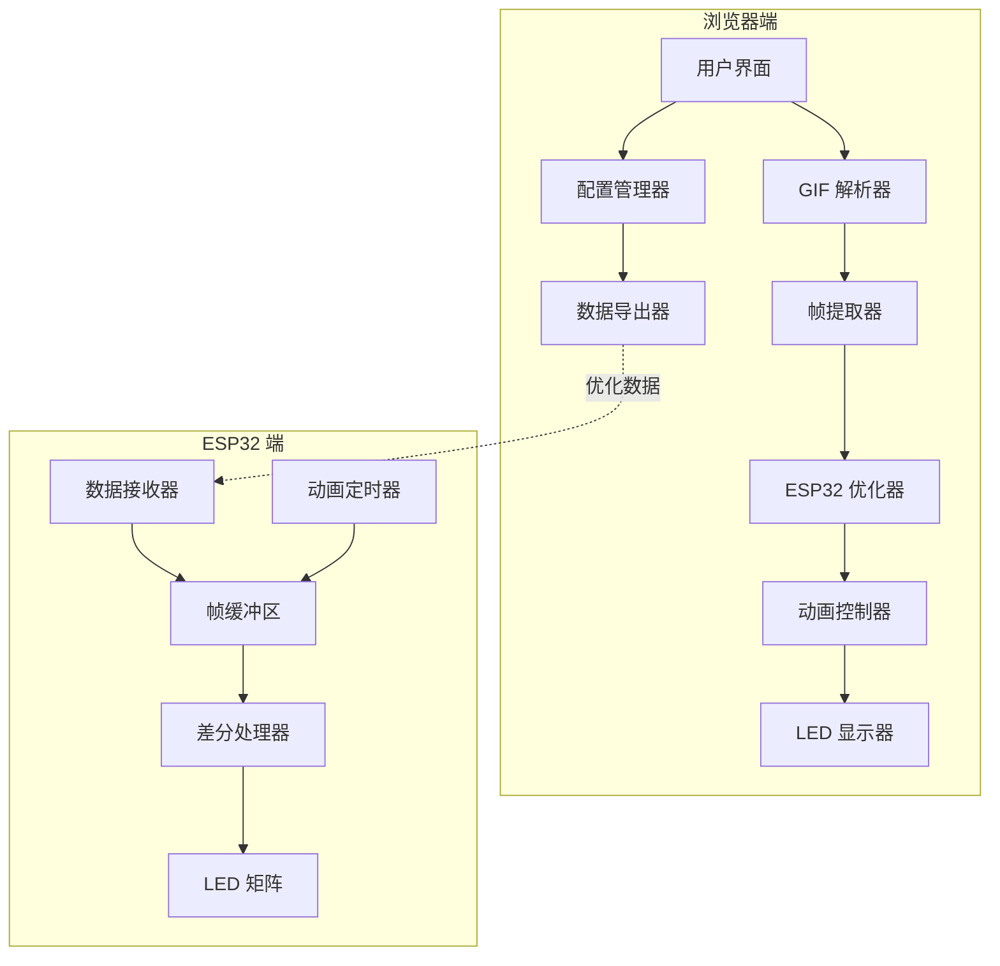

# 技术设计文档 - GIF 动画支持功能

## 概述

本设计文档描述了为 64x64 LED 矩阵模拟器添加 GIF 动画支持功能的技术实现方案。该功能将在现有的静态图片显示基础上，增加动画播放能力，并针对 ESP32 的内存和处理能力限制进行优化。

核心技术挑战包括：
- ESP32 内存限制（320KB SRAM）下的动画数据管理
- 高效的差分数据压缩算法设计
- 实时帧切换和播放控制
- 与现有 LED 模拟器的无缝集成

## 架构

### 系统架构图



### 数据流架构

1. **输入阶段**: 用户上传 GIF 文件
2. **解析阶段**: 使用 gifuct-js 库解析 GIF 结构和帧数据
3. **优化阶段**: 缩放、颜色转换、差分计算
4. **播放阶段**: 浏览器端实时动画预览
5. **导出阶段**: 生成 ESP32 兼容的数据格式

## 组件和接口

### GIF 解析器 (GIF_Parser)

**职责**: 解析 GIF 文件，提取帧数据和元信息

**接口**:
```javascript
class GIFParser {
  async parseGIF(file: File): Promise<GIFData>
  extractFrames(gifData: GIFData): Promise<Frame[]>
  getMetadata(gifData: GIFData): AnimationMetadata
}

interface GIFData {
  width: number
  height: number
  frames: Frame[]
  globalColorTable: Color[]
  loopCount: number
}

interface Frame {
  imageData: ImageData
  delay: number
  disposal: number
  localColorTable?: Color[]
}
```

**技术实现**:
- 使用 gifuct-js 库进行 GIF 解析
- 支持 GIF87a 和 GIF89a 格式
- 处理透明度和局部颜色表
- 异步解析避免阻塞主线程

### ESP32 优化器 (ESP32_Optimizer)

**职责**: 将 GIF 数据优化为 ESP32 兼容格式

**接口**:
```javascript
class ESP32Optimizer {
  optimizeFrames(frames: Frame[]): OptimizedAnimation
  calculateDifferential(frame1: Frame, frame2: Frame): DifferentialData
  compressColorDepth(imageData: ImageData): RGB565Data
  validateMemoryUsage(animation: OptimizedAnimation): MemoryReport
}

interface OptimizedAnimation {
  metadata: {
    frameCount: number
    frameRate: number
    width: number
    height: number
    totalSize: number
  }
  frames: OptimizedFrame[]
}

interface OptimizedFrame {
  type: 'full' | 'differential'
  data: Uint16Array  // RGB565 格式
  changes?: PixelChange[]  // 仅差分帧使用
  size: number
}
```

**核心算法**:

1. **差分数据压缩算法**:
```javascript
function calculateDifferential(prevFrame, currentFrame) {
  const changes = []
  const threshold = 0.8  // 80% 阈值
  
  for (let i = 0; i < currentFrame.data.length; i++) {
    if (prevFrame.data[i] !== currentFrame.data[i]) {
      changes.push({
        index: i,
        color: currentFrame.data[i]
      })
    }
  }
  
  // 如果变化超过 80%，使用完整帧
  if (changes.length > currentFrame.data.length * threshold) {
    return {
      type: 'full',
      data: currentFrame.data
    }
  }
  
  return {
    type: 'differential',
    changes: changes
  }
}
```

2. **RGB565 颜色转换**:
```javascript
function convertToRGB565(r, g, b) {
  const r5 = (r >> 3) & 0x1F
  const g6 = (g >> 2) & 0x3F  
  const b5 = (b >> 3) & 0x1F
  return (r5 << 11) | (g6 << 5) | b5
}
```

### 动画控制器 (Animation_Controller)

**职责**: 管理动画播放状态和帧切换

**接口**:
```javascript
class AnimationController {
  play(): void
  pause(): void
  stop(): void
  setSpeed(multiplier: number): void
  setLoop(enabled: boolean): void
  getCurrentFrame(): number
  getTotalFrames(): number
}
```

**实现细节**:
- 使用 `requestAnimationFrame` 实现平滑播放
- 支持 0.5x 到 3x 播放速度调节
- 内存友好的帧缓存策略

### 帧缓冲管理器 (Frame_Buffer_Manager)

**职责**: 高效管理帧数据的内存使用

**策略**:
1. **懒加载**: 仅在需要时解码帧数据
2. **LRU 缓存**: 最近最少使用的帧优先释放
3. **预加载**: 预先加载下一帧以确保流畅播放

```javascript
class FrameBufferManager {
  constructor(maxMemory = 50 * 1024 * 1024) {  // 50MB 限制
    this.cache = new Map()
    this.maxMemory = maxMemory
    this.currentMemory = 0
  }
  
  getFrame(index) {
    if (this.cache.has(index)) {
      // 更新 LRU 顺序
      const frame = this.cache.get(index)
      this.cache.delete(index)
      this.cache.set(index, frame)
      return frame
    }
    
    // 加载新帧
    const frame = this.loadFrame(index)
    this.addToCache(index, frame)
    return frame
  }
  
  addToCache(index, frame) {
    // 检查内存限制
    while (this.currentMemory + frame.size > this.maxMemory) {
      this.evictOldestFrame()
    }
    
    this.cache.set(index, frame)
    this.currentMemory += frame.size
  }
}
```

## 数据模型

### ESP32 动画数据格式

```c
// ESP32 端数据结构
typedef struct {
    uint16_t width;
    uint16_t height;
    uint16_t frame_count;
    uint16_t frame_rate;  // 毫秒
    uint32_t total_size;
} animation_header_t;

typedef struct {
    uint8_t type;  // 0=完整帧, 1=差分帧
    uint16_t size;
    uint8_t data[];
} frame_header_t;

typedef struct {
    uint16_t index;  // 像素索引 (y * width + x)
    uint16_t color;  // RGB565 颜色值
} pixel_change_t;
```

### 内存布局优化

```
动画数据内存布局:
┌─────────────────┬──────────────┬─────────────────┐
│ Animation Header│ Frame Headers│ Frame Data      │
│ (12 bytes)      │ (variable)   │ (variable)      │
└─────────────────┴──────────────┴─────────────────┘

单帧数据布局:
完整帧: [type:1][size:2][rgb565_data:size]
差分帧: [type:1][size:2][change_count:2][changes:variable]
```

### 数据压缩策略

1. **颜色量化**: 24位 RGB → 16位 RGB565 (节省 33% 空间)
2. **差分编码**: 仅存储变化像素 (平均节省 60-80% 空间)
3. **帧类型混合**: 自适应选择完整帧或差分帧
4. **RLE 压缩**: 对连续相同颜色进行游程编码

## 错误处理

### 错误类型和处理策略

1. **文件格式错误**:
   - 检测: MIME 类型验证 + 文件头检查
   - 处理: 显示用户友好的错误信息

2. **内存不足错误**:
   - 检测: 监控内存使用量
   - 处理: 自动降低质量或拒绝加载

3. **解析错误**:
   - 检测: try-catch 包装解析过程
   - 处理: 回退到错误状态，清理资源

4. **播放错误**:
   - 检测: 帧数据完整性检查
   - 处理: 跳过损坏帧或停止播放

```javascript
class ErrorHandler {
  static handleGIFError(error, context) {
    switch (error.type) {
      case 'INVALID_FORMAT':
        return '不支持的 GIF 格式，请选择标准 GIF 文件'
      case 'MEMORY_EXCEEDED':
        return 'GIF 文件过大，请选择较小的文件或降低质量'
      case 'PARSE_ERROR':
        return 'GIF 文件损坏，无法解析'
      default:
        return '未知错误，请重试'
    }
  }
}
```

## 测试策略

### 单元测试

**GIF 解析测试**:
- 测试各种 GIF 格式的解析正确性
- 验证帧提取的完整性
- 检查元数据解析的准确性

**优化算法测试**:
- 验证差分算法的正确性
- 测试颜色转换的精度
- 检查内存使用量计算

**动画控制测试**:
- 测试播放控制功能
- 验证帧率调节的准确性
- 检查循环播放逻辑

### 集成测试

**端到端测试**:
- 完整的 GIF 上传到播放流程
- 与现有图片功能的兼容性
- ESP32 数据格式的正确性

**性能测试**:
- 大文件处理性能
- 内存使用量监控
- 播放流畅度测试

### 属性测试配置

使用 fast-check 库进行属性测试，每个测试运行最少 100 次迭代：

```javascript
// 示例属性测试
fc.test('差分压缩往返测试', fc.array(fc.integer(0, 65535)), (frameData) => {
  const compressed = compressDifferential(frameData)
  const decompressed = decompressDifferential(compressed)
  return JSON.stringify(frameData) === JSON.stringify(decompressed)
})
```

**测试方法**:
- **单元测试**: 验证具体示例、边界情况和错误条件
- **属性测试**: 验证跨所有输入的通用属性
- 两种方法互补，确保全面覆盖

**属性测试重点**:
- 通过随机化实现全面的输入覆盖
- 验证对所有输入都成立的通用属性
- 每个属性测试必须引用其设计文档属性
- 标签格式: **Feature: gif-animation-support, Property {number}: {property_text}**